# F1 — visual parity audit: Selom vs cnsplots

Run 2026-08-03. Method + acceptance: `spec.md` §1. This is the artifact that makes F2 a checklist
instead of taste, and it is **re-run at the end of F2** with the same table as the proof.

Re-run Selom's side: `uv run python scripts/render_parity.py --out ../../docs/cnsplots-port/audit`
(needs `SELOM_DATASETS_DIR` + Chrome). cnsplots' side: `audit/render_cns.py`, in a throwaway venv
outside the repo.

---

## 0. The headline, before the styling

The premise of the phase — *"their plots look better"* — is correct, and the ported styling values
in §3 are real. But the audit found something the phase charter did not predict:

> **Three of the five audited plot types have a defect that is not a styling gap.** Two of them
> (`enrichment`, `heatmap`) are *unreadable*: one draws its dots at 1–3 **pixels**, the other
> silently mislays 7 of 17 clusters. No amount of theme porting fixes either.

So F2's checklist grew a prerequisite: **F1.5 — fix what is broken before restyling what is ugly.**
A restyle applied on top of these would produce a prettier unreadable figure.

**F1.5 is done: all three are fixed**, each with an after-image below and a regression test in
`app/backend/tests/test_figure_encoding_integrity.py`. The "Selom (as shipped)" images throughout
this document are kept deliberately — they are the *before* evidence, and the §3 styling table is
still the open work.

The three defects, then the styling table.

---

## 1. Confirmed defects (not styling — correctness)

### D1 — `enrichment` dot sizes are 1–3 px, so the dot plot has no visible dots — **FIXED**

| Selom (before) | cnsplots, **identical numbers** | Selom (after) |
|---|---|---|
| 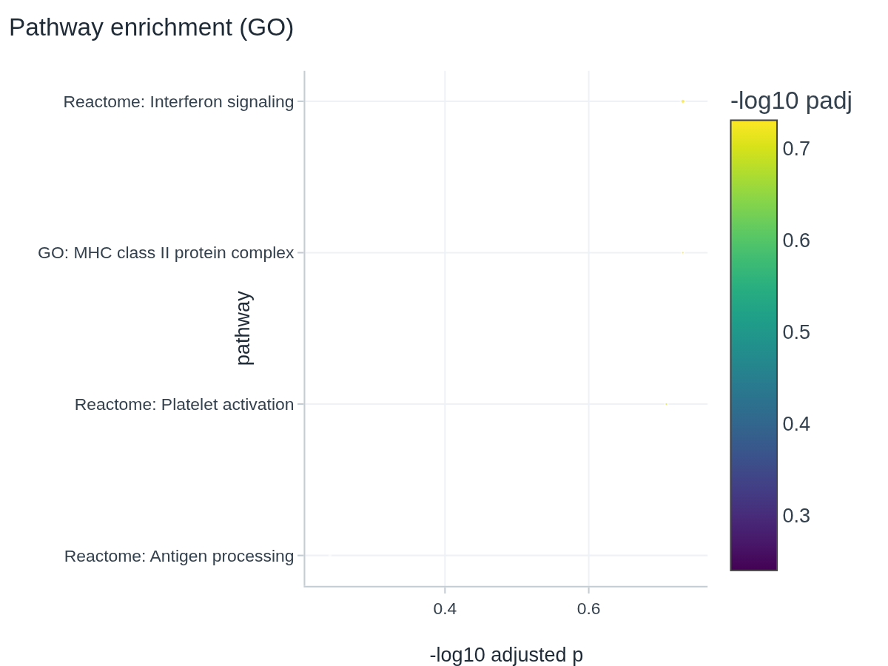 | 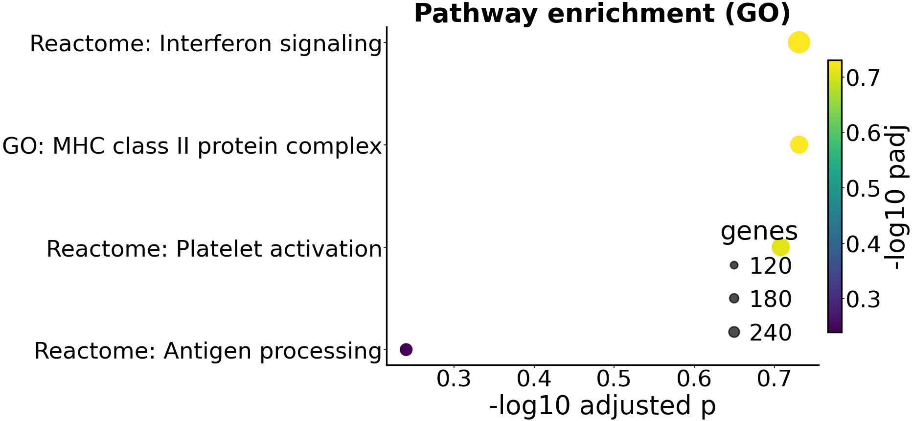 | 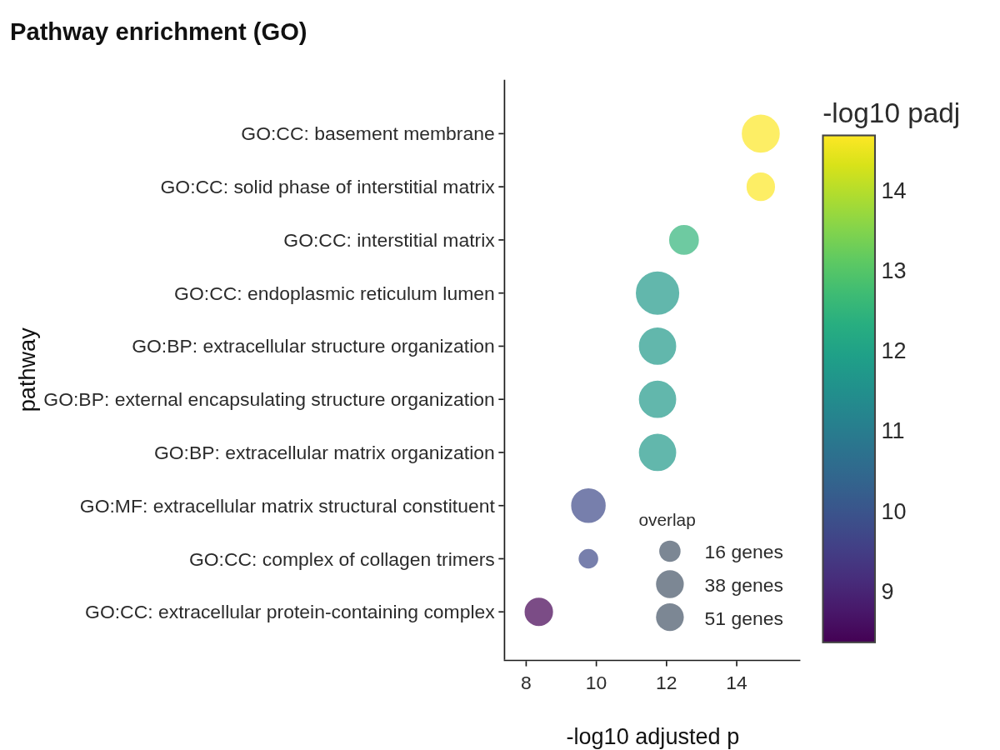 |

The skill emits `marker.size = [1, 2, 3, 3]` (the gene count per term) with
`marker.sizemode = "diameter"`. In Plotly `sizemode: "diameter"` means **size is a diameter in
pixels** — so the dots are literally 1–3 px across and the size encoding is invisible. matplotlib's
`s` is an *area in points²*, which is why the same array renders as readable dots on the right.

Two consequences, both visible above:

- the dot plot's entire size channel (genes per term) cannot be read;
- **there is no size legend at all**, so even at a correct size the reader could not decode it.
  cnsplots emits one by default.

**Fixed:** counts now map to a 6–26 px diameter band — the same band the `markers` dotplot already
used, which is the in-repo precedent — and the figure emits a **size key** as legend proxy traces,
placed inside the axes at the bottom-right (the colourbar owns the right margin, and this figure
type sorts terms by significance, so its bottom row always carries the smallest x and that corner
is structurally empty). The diverging up/down variant scales **both directions on one scale**, so
an overlap of *n* is the same dot either way — scaling per trace would have made the encoding lie.
Home is the `enrichment` skill's figure builder, not `theme.py`: the theme must not learn a skill's
data semantics (spec D1).

### D2 — `heatmap` loses 7 of its 17 clusters and orders the rest lexicographically — **FIXED**

| Selom (before) | Selom (after) |
|---|---|
| 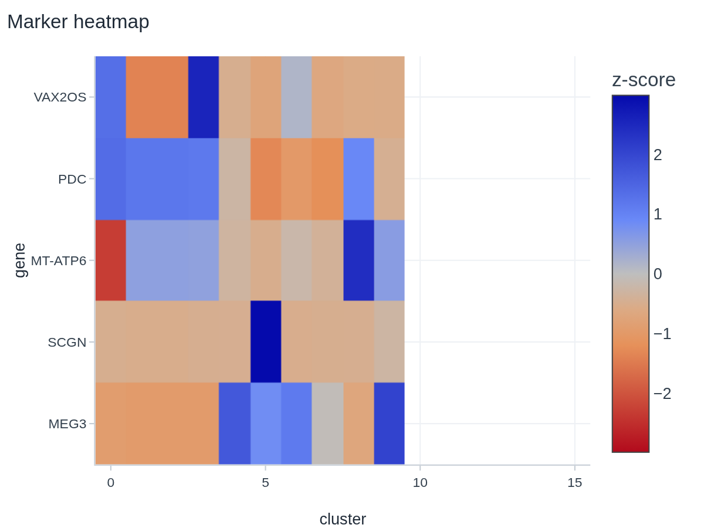 | 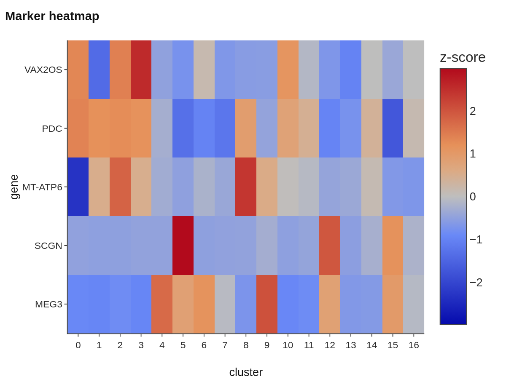 |

The trace's `x` is `['0','1','10','11','12','13','14','15','16','2',…,'9']` — **strings that look
like numbers, in lexicographic order**. Plotly coerces a numeric-looking string axis to a *linear*
axis, so the columns are placed at their numeric values instead of at consecutive category slots.
The result on the left: the matrix occupies ~55% of the canvas, ticks run to 16 past the data, and
the columns that should be clusters 10–16 are not readable as distinct columns.

This is a **data-integrity** defect, not a cosmetic one: a reader of the shipped figure draws
conclusions about cluster identity from column position, and the position is wrong. Lexicographic
ordering alone would be a defect even if the axis type were right (cluster 10 sits between 1 and 11).

**Fixed** in two places, because it is two bugs wearing one symptom:

- **Axis type** — `heatmap_spec` now pins `type: "category"` on both axes, in the plain *and* the
  clustermap branch. That is correct for every heatmap regardless of label shape: a heatmap axis
  carries labels, never a scale.
- **Order** — `numeric_label_order` (in `skills/_plotly.py`, so it is reusable) returns the
  permutation that puts numeric-looking labels in numeric order, and returns `None` for anything
  else so a caller's deliberate ordering is never disturbed. It returns *indices* because the
  caller always has a matrix to permute in step.

The after-image is the real code path, not a hand-patched spec. All 17 clusters, evenly spaced, in
cluster order.

**The class was then swept, with evidence rather than inspection.** `smoke.check_figure` gained the
invariant — *an axis carrying numeric-looking string categories must declare `type: "category"`* —
so it now runs against **every registered skill on real data** on every `scripts/skill-smoke.sh`
run, and any future skill inherits it. The sweep found exactly **one** more instance:

- **`cluster`** — its cluster-size bar chart, in both the real engine and the stub. The stub hid it
  perfectly: with six clusters at `0`–`5`, a linear axis and a category axis render identically,
  so the bug only appears past ten clusters. That is precisely the case a golden test cannot catch
  and the real corpus can.

`markers`, `composition`, `deg` and the other `str(...)`-labelled skills came back clean. Full
matrix after the fixes: **35 pass · 0 fail · 1 skipped** (`facs_gating`, the known corpus gap).

### D3 — the on-screen figure and the exported figure render in different typefaces — **FIXED**

`skills/styles.py` set the default style's `font_family` to
`"Inter, 'Helvetica Neue', Helvetica, Arial, sans-serif"`; `lib/figure/figure-spec.ts` declared
`"Inter, ui-sans-serif, system-ui, sans-serif"` for the browser. **Inter is bundled by neither
side** — `app/layout.tsx` loads Geist via `next/font`, and a repo-wide search finds `Inter` named
in exactly two places and fetched in zero.

Fonts were **measured**, not assumed: the same string rendered through Kaleido/Chrome at 40 px,
compared by ink width.

| Declared stack | Ink width | Resolves to |
|---|---|---|
| `Inter` alone | 448 px | *nothing* — identical to a deliberately nonexistent family |
| `ZzzNoSuchFontZzz` | 448 px | Chrome's last-resort face |
| **backend stack** (`Inter, 'Helvetica Neue', Helvetica, Arial, sans-serif`) | **466 px** | **Liberation Sans** (Arial metrics) |
| **frontend stack** (`Inter, ui-sans-serif, system-ui, sans-serif`) | **517 px** | **DejaVu Sans** |
| `Arimo, Arial, Helvetica, sans-serif` (the journal styles) | 466 px | Liberation Sans |

So the defect is not "everything renders in DejaVu". It is worse in kind and smaller in blast
radius: **the two stacks fall through to different places**, so the figure a user edits on screen
and the figure they download are set in different typefaces — an **11% difference in string width**
for the same text, which moves label wrapping and decides whether labels overlap. WYSIWYG is broken
on the one output the product exists to produce.

`Inter` itself renders nowhere, on either side, and the frontend's font picker offered it by name.

The journal styles were already correct — `Arimo` is metric-compatible with Arial by design, which
is exactly why it degrades to the same face everywhere. Only the default style diverged.

**Fixed** by converging both sides on that same stack (`SANS_OPEN` / `Arimo, Arial, Helvetica,
sans-serif`) and relabelling the picker entry to what it actually renders. The alternative — bundle
Inter properly via `next/font/local` *and* install the face into the backend render image — is the
higher-fidelity path but depends on a backend Dockerfile that does not exist yet (a standing
deferred item), and would reintroduce this exact divergence the day it deployed without it.

### Not a defect: SVG export keeps live text

The check owed by `plan.md` §5 — does Kaleido outline text? — **passes.** A rendered SVG carries 16
`<text>` elements with the gene symbols intact and a `font-family` attribute (`audit/selom/box.svg`
is kept as evidence). Selom's "editable vector export" claim holds. Note this is *because* the
fallback still emits text; it is unrelated to D3.

---

## 2. The five plot types, side by side

Both sides are the **same numbers**: Selom's skills ran on the real corpus, and the resulting
arrays were fed verbatim to cnsplots, so every difference below is renderer or styling, never data.

Canvas: 6.0 × 4.5 in at 200 dpi. Selom lands exactly on 1200 × 900; cnsplots' figures are saved
with matplotlib's `bbox_inches="tight"` and so vary (863–917 px tall). cnsplots' 8 pt house type
is scaled ×2.4 to the audit canvas — it is tuned for a 150 pt (~2.1 in) panel, and at native size
on a 6 in canvas nothing would be legible. **Ratios are preserved, absolute point sizes are not**;
§3 quotes cnsplots' native values, not the scaled ones.

### box — `boxplot`, ERG b-wave by condition

| Selom | cnsplots |
|---|---|
| 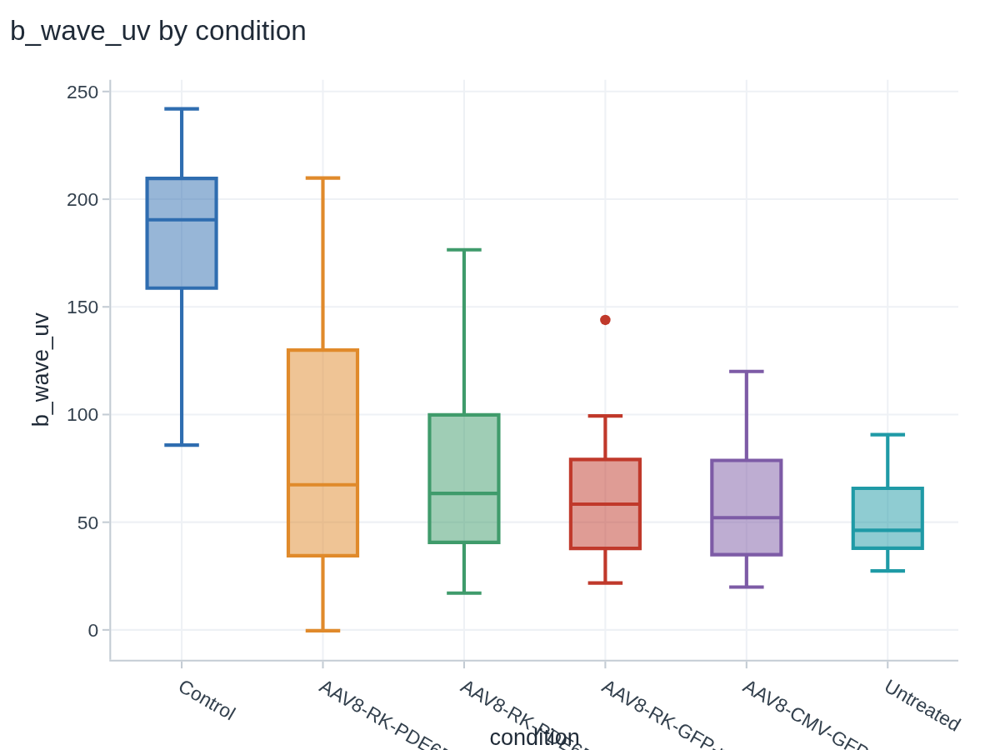 | 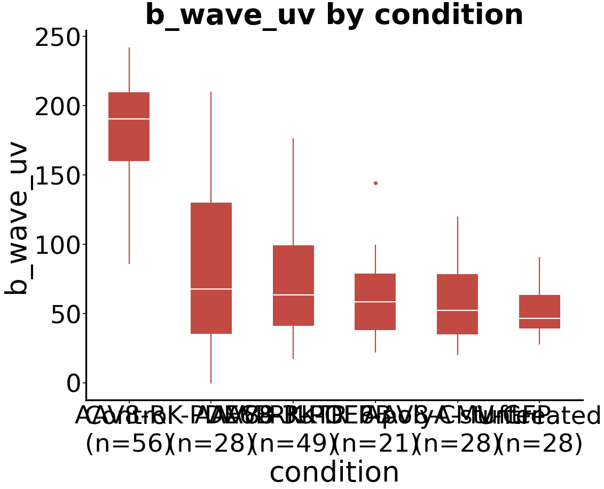 |

Selom: grid on, light-grey axis, left-aligned regular title, **one colour per box**. cnsplots:
gridless, black spines (bottom+left only), **bold centred title**, one colour for every box, and
`n=` counts under each category.

**Both handle the long category labels badly, and cnsplots handles them worse** — its labels
overlap into an unreadable smear, while Selom's rotated labels stay legible but collide with the
`condition` axis title and clip at the right edge. This is the audit's clearest "do not port"
row: long-label layout is a *shared* gap, and Selom is currently ahead.

### scatter — `pca`, JEV proteome samples

| Selom | cnsplots |
|---|---|
| 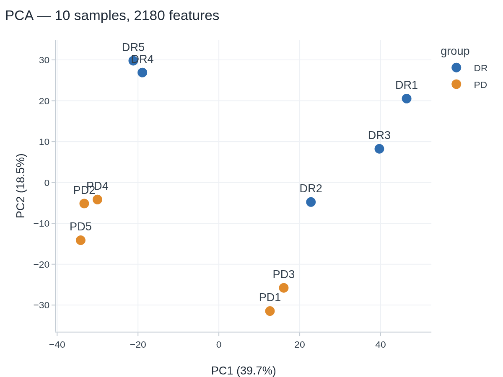 | 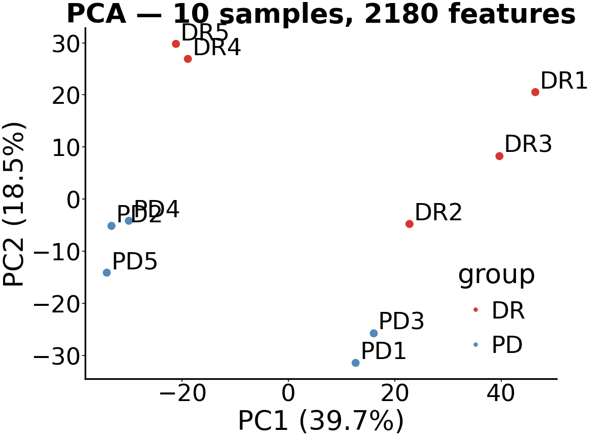 |

The closest pair. Differences are the same base set (grid, tick colour, title weight/position) plus
marker size — Selom's 12 px points against cnsplots' small dots.

**Point-label collision is unsolved on both sides** (`PD2`/`PD4` overlap in both; `DR4`/`DR5` in
both). cnsplots does not apply `adjustText` in `scatterplot`, so there is nothing to port — this is
a genuine gap for F4 and, if Selom builds it, a differentiator rather than a catch-up.

### heatmap — `heatmap`, marker z-scores per Leiden cluster

| Selom | cnsplots |
|---|---|
|  | 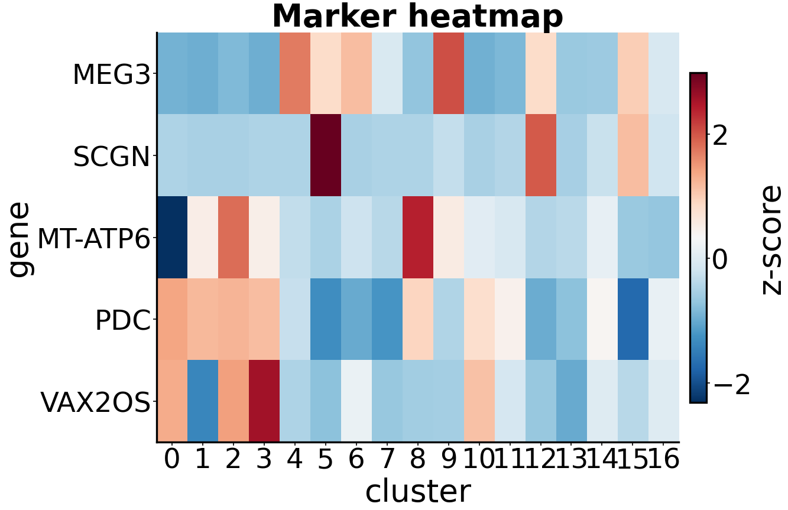 |

Dominated by **D2**. Beyond it: Selom draws a grid *through* a heatmap (meaningless on a filled
matrix), and its colour scale runs `RdBu` with **blue = high** — inverted from the genomics
convention where red is high expression. cnsplots renders `RdBu_r` (red high).

The `gene` axis title sits jammed against the row labels on Selom's side — the same automargin
collision as the dot plot.

### volcano — `volcano`, JEV EV proteome DE

| Selom | cnsplots |
|---|---|
| 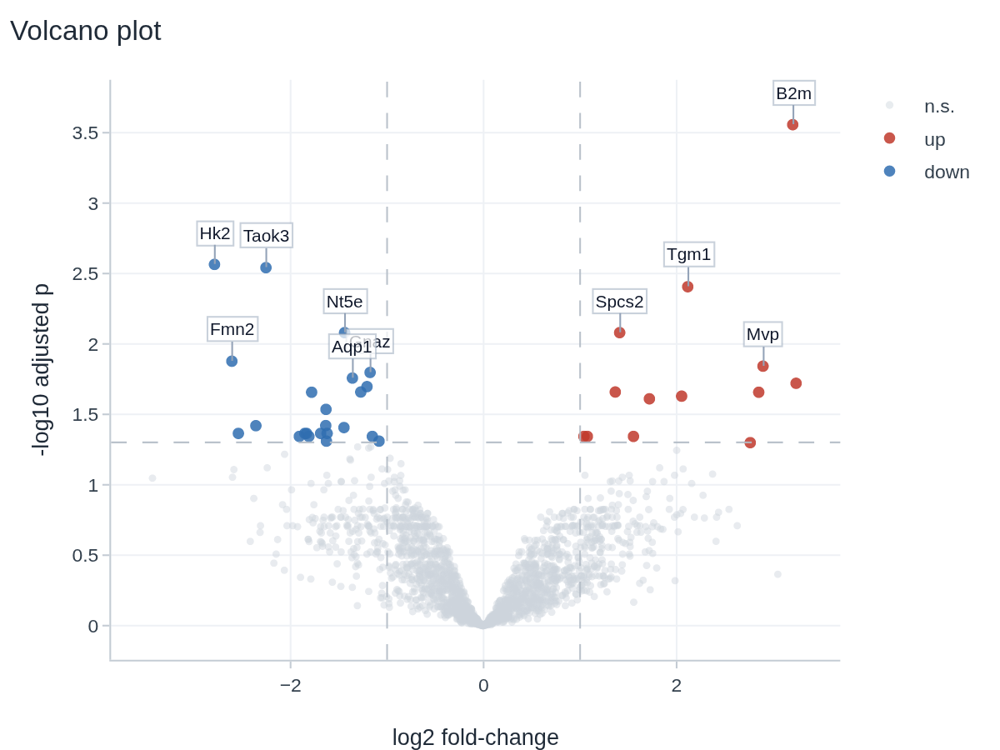 | 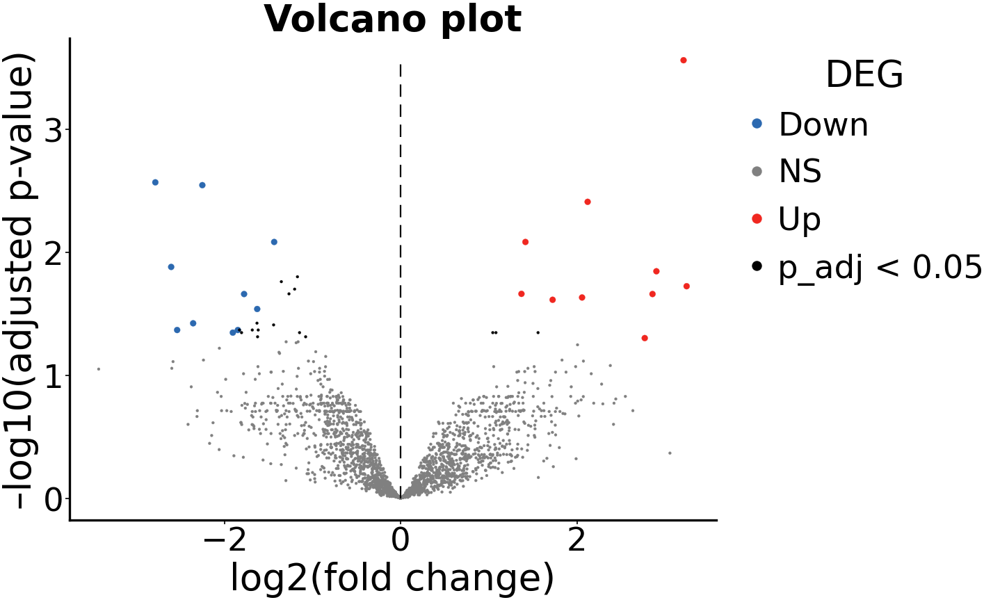 |

Selom's is **more informative** — it labels the top genes with leader lines, which cnsplots'
`volcanoplot` did not draw at all here. But Selom's labels overlap each other (`Aqp1` occludes its
neighbour), and each label carries a bordered white box that is heavy for print.

cnsplots is cleaner in the point cloud: smaller markers, a thin dashed zero line, an unframed
legend with a title, and a fourth class (`p_adj < 0.05` but sub-threshold fold change) that Selom
folds into `n.s.`.

*Caveat:* because cnsplots drew no gene labels, this pair does **not** compare label placement.

### dotplot — `enrichment`, GO/Reactome ORA

Covered as **D1** above.

---

## 3. The difference table — what F2 ports

Verdicts per `spec.md` §1.4. cnsplots values are its native settings (`cnsplots.settings`,
v0.6.0); Selom values are measured from `audit/selom-probe.json`.

| # | Heading | cnsplots | Selom today | Verdict | Note |
|---|---|---|---|---|---|
| 1 | Typography — title weight | `bold` | regular | **PORT** | Single biggest "reads as a journal figure" cue. |
| 2 | Typography — title position | `center` | `left` | **CHECK** | Journal-dependent; Cell/Nature captions sit below. Decide per style pack, not globally. |
| 3 | Typography — title:body ratio | 8 pt title / 7 pt ticks (1.14×) | 16 px / 11 px (1.45×) | **PORT** | Selom's title is proportionally oversized; flatten the ramp. |
| 4 | Typography — family | Helvetica → Arial → DejaVu | `Inter` (**never loaded**; FE and BE resolved differently) | **PORT** | = **D3**. cnsplots targets the same Arial-metric face Selom now converges on. |
| 5 | Grid | `axes.grid = False` | on for box/scatter/volcano/heatmap | **PORT** | Publication default is gridless. Keep a per-style override. |
| 6 | Spines | bottom + left only, `black`, 0.5 pt | `showline` both, `#c4ccd4`, 1 px | **PORT** | Black at 0.5 pt vs light grey at 1 px is most of the "print vs dashboard" feel. |
| 7 | Tick geometry | len 2 pt, width 0.6 pt, pad 1 pt | len 4 px (3 pt), width 1 px (0.75 pt) | **PORT** | Selom's ticks are ~50% too long and heavy. |
| 8 | Tick colour | `black` | `#c4ccd4` (axis) / `#33404d` (labels) | **PORT** | Grey ticks lose contrast in print. |
| 9 | Axis margins | 5% on x and y | Plotly default | **PORT** | Stops data touching the spine. |
| 10 | Legend frame | `frameon = False` | already transparent | — | Already equivalent. |
| 11 | Legend density | `markerscale 0.5`, handles 0.7×0.7, pad 0.3 | Plotly default | **PORT** | Recovers plot width; Selom's legend block is wide. |
| 12 | Colour — categorical | palette encodes **something**; one colour otherwise | one colour per category always | **PORT** | Not a palette swap — a *rule*: colour only when it carries information (see box). |
| 13 | Colour — palette values | `Ecotyper1` default; `Cell`/`Nature`/`Science`/`NEJM`/`Lancet`/`JAMA`/`JCO` packs | Selom 8-colour + Okabe–Ito on journal styles | **CHECK** | Take the *journal* packs into the registry. Check each against the `dataviz` CVD rules before shipping — several are not colourblind-safe. |
| 14 | Colour — sequential | `gnuplot` | `Viridis` | **REJECT** | Viridis is perceptually uniform and CVD-safe; `gnuplot` is neither. Selom is right. |
| 15 | Colour — diverging direction | `RdBu_r` (red high) | `RdBu` (blue high) | **PORT** | Selom is inverted vs the field convention for expression z-scores. |
| 16 | Marker size — dense scatter | small points | 6.5 px (volcano), 12 px (PCA) | **PORT** | Only for dense clouds; PCA's large points are fine at n=10. |
| 17 | Background | `savefig.transparent = True` | white paper | **CHECK** | Transparent composites better into a multi-panel; white is safer for a naive download. Offer both at export. |
| 18 | SVG text | `svg.fonttype = "none"` (live text) | live text | — | Already equivalent; §1 check passed. |
| 19 | Annotation — significance | `pairs=` brackets + stars built in | none | **PORT** (F4) | Highest-value missing item; the ERG work hand-rolled it. |
| 20 | Annotation — group counts | `add_count=True` → `n=` per category | none | **PORT** | Cheap, and reviewers ask for it. |
| 21 | Long category labels | overlapping smear | rotated, legible, collides with axis title | **REJECT** | Selom is **ahead**; fix Selom's own collision, do not port. |
| 22 | Point-label collision | not solved (`adjustText` unused) | not solved | **REJECT** | Shared gap → F4 opportunity, not a port. |
| 23 | Axis-title vs long tick labels | n/a | title collides with labels (dot plot, heatmap) | **PORT**\* | \*Selom-only fix, no cnsplots source. Automargin must reserve for the title too. |
| 24 | Panel geometry | 150 × 150 pt panel, `figure_dpi 144` / `savefig 288` | figure-driven, export presets in mm | **CHECK** | Selom's mm-based presets are the better model; take cnsplots' *max panel height* research into the packs. |

**Ported: 14 · Rejected: 4 · Check (needs a journal guideline or a product call): 5 · Already equal: 2.**

### F2 status — 10 of the 14 PORT rows are closed

Closed as **style tokens** in `skills/styles.py`, so one edit restyles all 36 skills and every
journal pack inherits the mechanism: rows **1** (bold title), **3** (title 16 → 14 px, flattening
the 1.45× ramp), **4** (font family — this was D3), **5** (gridless), **6** (black spines at
0.8 px), **7** (ticks 4 → 3 px long, 1 → 0.8 px wide), **8** (black tick furniture, darker labels),
**11** (legend `itemwidth`/`tracegroupgap`), **15** (diverging matrices put HIGH at the red end),
**19–20 partially** — `enrichment` gained its size key, but significance brackets and `n=` counts
are still F4.

The frontend's own defaults (`lib/figure/figure-spec.ts`) were moved in step, because they fill
what the backend theme did not set — a figure a *skill* produced and a figure the *editor* created
would otherwise have sat in the same library looking like different products.

**Still open from this table:** row 2 (title alignment — a per-journal decision), rows 13 and 24
(the journal packs and their panel geometry, which need each journal's own author guidelines, spec
D4), row 17 (transparent vs white export background — a product call), and rows **21–23**, the
layout defects that are Selom's own and which cnsplots does *not* solve either: long category
labels colliding with the axis title, point-label collision, and the axis title colliding with long
tick labels. Those three are where Selom can beat the reference rather than match it.

### F2 before / after, same data, same canvas

| | Before | After |
|---|---|---|
| box |  | 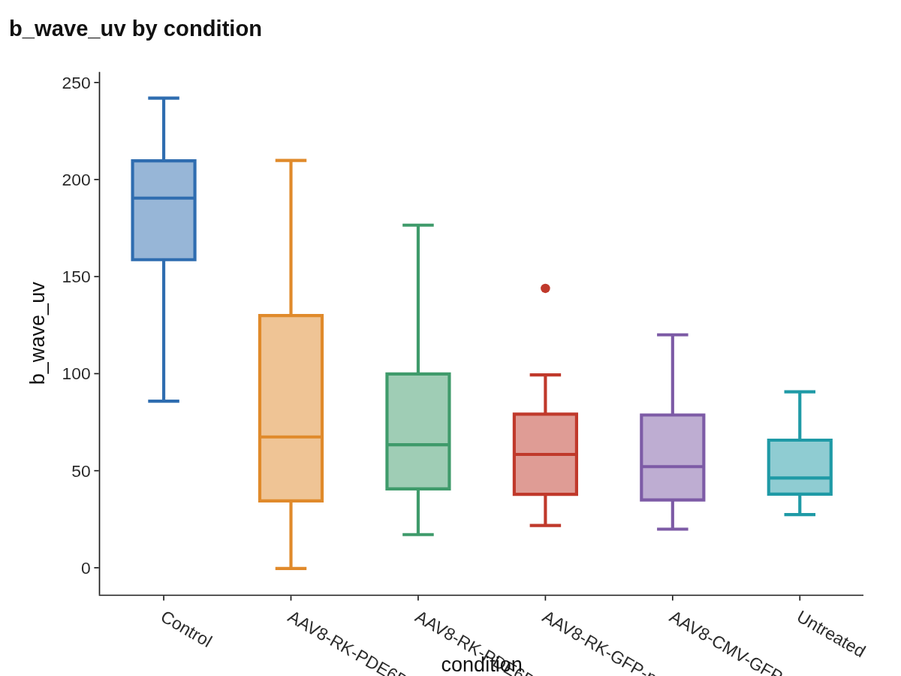 |
| scatter |  | 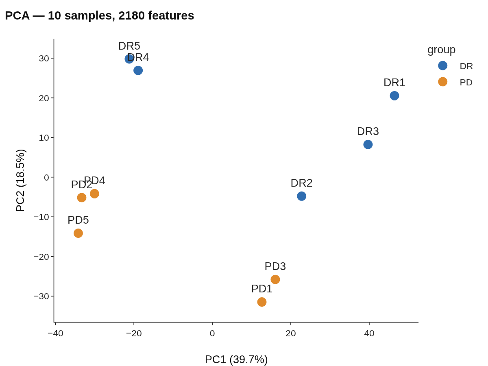 |
| heatmap |  |  |
| volcano |  | 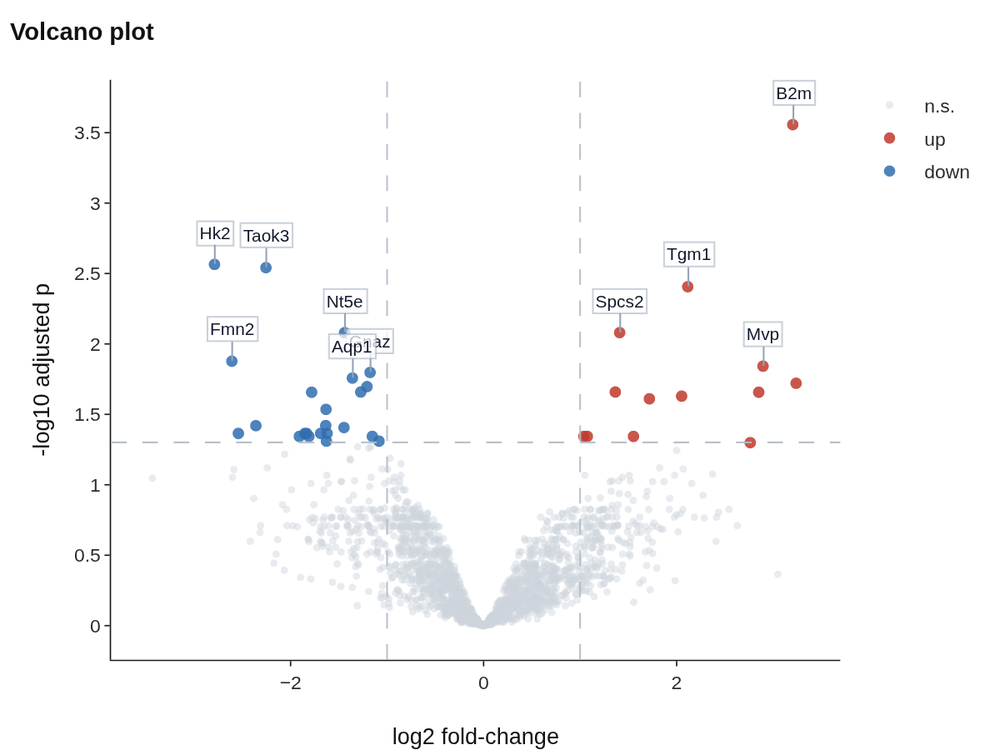 |
| dotplot |  |  |

The remaining visible blemishes — the box plot's clipped category labels, the volcano's overlapping
gene labels — are rows 21–23 above, and are deliberately still open.

---

## 4. What F2 should do, in order

1. ~~**F1.5 first — D1, D2, D3.**~~ **Done.** Regression tests in
   `tests/test_figure_encoding_integrity.py`; goldens re-baselined and the diff reviewed as a set
   (35 files: font-family only, except `enrichment` gaining the dot sizes + size key and `heatmap`
   gaining the two `type: "category"` pins — nothing else moved). The D2 sweep is done and is now a
   standing invariant in `smoke.check_figure`; it found one more skill (`cluster`).
2. **The base restyle** — rows 1, 3, 5, 6, 7, 8, 9, 11 land as style tokens in `skills/styles.py`.
   All eight are single values; none needs a skill to change.
3. **The rules, not the values** — row 12 (colour only when it encodes) and row 15 (diverging
   direction) are decisions the theme applies per figure kind, so they belong in `theme.py`'s
   `_KIND` dispatch.
4. **Row 23 and Selom's own label collisions** — the layout defects the audit found that cnsplots
   does not solve either. These are where Selom can beat it rather than match it.
5. **The journal packs** (row 13, 24) — verify against each journal's author guidelines, ship
   unverified ones as `draft` (spec D4).

`spec.md` §2 already says the registry is the one home and that no skill learns about styling. That
holds for everything except D1/D2, which are skill-level data defects and must be fixed there.

---

## 5. Honest limits of this audit

- cnsplots' figures use `bbox_inches="tight"`, so their canvases differ from Selom's exact
  1200 × 900. Absolute whitespace is therefore **not** comparable; ratios and treatments are.
- cnsplots' type was scaled ×2.4 to the shared canvas. §3 quotes native values.
- `cns.volcanoplot` drew no gene labels on this input, so **label placement was not compared** on
  the volcano pair.
- The heatmap pair uses `imshow` + `cns.setup_ax` rather than `cns.heatmapplot`, which takes an
  `AnnData` and builds its own clustered figure — that would have compared two different *figures*
  instead of two renderings of one matrix. `setup_ax` is the cnsplots styling layer either way,
  which is what §3 is measuring.
- Five plot types, not 36. The base rows (1, 3, 5–9, 11) are style-wide and generalise; the
  figure-kind rows (12, 15, 16, 19, 20) were observed on the types listed and should be re-checked
  as each kind is restyled.
